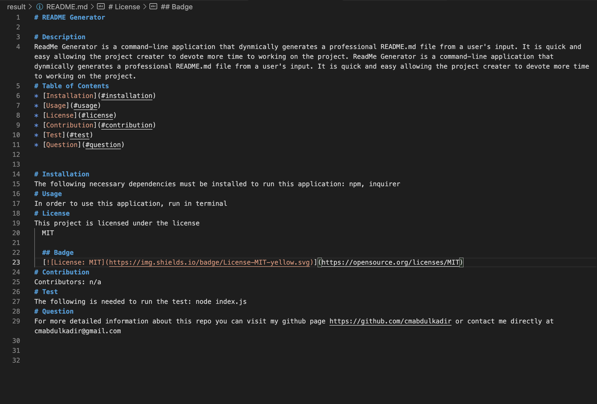

# README Generator

## Purpose

ReadMe Generator is a command-line application that dynmically generates a professional README.md file from a user's input. It is quick and easy allowing the project creater to devote more time to working on the project. 

## Tech Stack

README Generator is built on the following:

- [Inquirer package](https://www.npmjs.com/package/inquirer). Review the [Good README Guide](../../01-HTML-Git-CSS/04-Important/Good-README-Guide/README.md) as a reminder of everything that a high-quality, professional README should contain. 

## Development

Pull this repo and run this code in the terminal

## Installation
npm/inquirer install

## License
none

## Usage
Open intergrated terminal/bash and run node idex.js

## Information 

Below you will find a link to my walkthrough recording of the README GENERATOR

https://drive.google.com/file/d/1PgbXC2yLO5jYKo63yGnrfSoH660ZvJ08/view

